# Architecture

> System overview, component hierarchy, and design decisions for Termux Bootstrap.

---

## Table of Contents

- [Project Architecture](#project-architecture)
- [Initialization Flow](#initialization-flow)
- [Library Hierarchy](#library-hierarchy)
- [CLI Architecture](#cli-architecture)
- [Module System](#module-system)
- [Dependency Resolution](#dependency-resolution)
- [Installer Workflow](#installer-workflow)
- [Profile Execution](#profile-execution)
- [Configuration Engine](#configuration-engine)
- [Logging System](#logging-system)
- [Error Handling](#error-handling)
- [Package Management](#package-management)
- [Testing Architecture](#testing-architecture)
- [CI Pipeline](#ci-pipeline)
- [Design Decisions](#design-decisions)

---

## Project Architecture

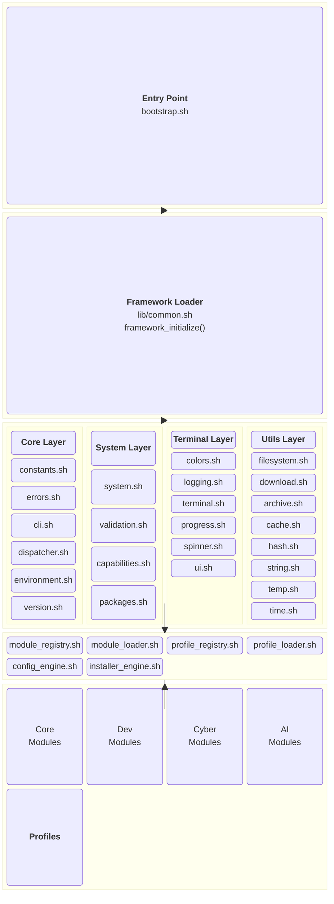
```mermaid
block-beta
  columns 1

  block:Entry
    columns 1
    bootstrap.sh("<b>Entry Point</b><br/>bootstrap.sh")
  end

  block:Loader
    columns 1
    common_sh("<b>Framework Loader</b><br/>lib/common.sh<br/>framework_initialize()")
  end

  block:Layers
    columns 4

    block:Core
      columns 1
      C_title("<b>Core Layer</b>")
      C1("constants.sh")
      C2("errors.sh")
      C3("cli.sh")
      C4("dispatcher.sh")
      C5("environment.sh")
      C6("version.sh")
    end

    block:System
      columns 1
      S_title("<b>System Layer</b>")
      S1("system.sh")
      S2("validation.sh")
      S3("capabilities.sh")
      S4("packages.sh")
    end

    block:Terminal
      columns 1
      T_title("<b>Terminal Layer</b>")
      T1("colors.sh")
      T2("logging.sh")
      T3("terminal.sh")
      T4("progress.sh")
      T5("spinner.sh")
      T6("ui.sh")
    end

    block:Utils
      columns 1
      U_title("<b>Utils Layer</b>")
      U1("filesystem.sh")
      U2("download.sh")
      U3("archive.sh")
      U4("cache.sh")
      U5("hash.sh")
      U6("string.sh")
      U7("temp.sh")
      U8("time.sh")
    end

  end

  block:Orchestration
    columns 4
    O1("module_registry.sh")
    O2("module_loader.sh")
    O3("profile_registry.sh")
    O4("profile_loader.sh")
    O5("config_engine.sh")
    O6("installer_engine.sh")
  end

  block:Domain
    columns 4
    D1("Core<br/>Modules")
    D2("Dev<br/>Modules")
    D3("Cyber<br/>Modules")
    D4("AI<br/>Modules")
    D5("<b>Profiles</b>")
  end

  Entry --> Loader
  Loader --> Layers
  Layers --> Orchestration
  Orchestration --> Domain
```

### Design Principles

1. **Single Responsibility** — Every function has exactly one purpose
2. **No Side-Effects at Sourcing** — Libraries define functions only; never execute code during load
3. **Guard-Controlled Initialization** — `framework_initialize()` is the sole entry point for setup
4. **Idempotent Operations** — Loading a module or profile twice produces no errors
5. **Fail-Fast with Rollback** — Installation failures trigger automatic rollback when enabled

---

## Initialization Flow

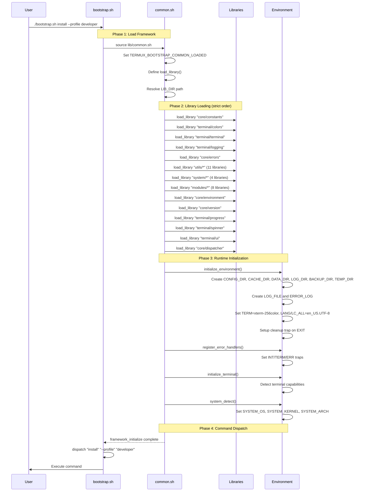
```mermaid
sequenceDiagram
    participant User
    participant BS as bootstrap.sh
    participant CS as common.sh
    participant Libs as Libraries
    participant Env as Environment

    User->>BS: ./bootstrap.sh install --profile developer

    Note over BS,CS: Phase 1: Load Framework
    BS->>CS: source lib/common.sh
    CS->>CS: Set TERMUX_BOOTSTRAP_COMMON_LOADED
    CS->>CS: Define load_library()
    CS->>CS: Resolve LIB_DIR path

    Note over CS,Libs: Phase 2: Library Loading (strict order)
    CS->>Libs: load_library "core/constants"
    CS->>Libs: load_library "terminal/colors"
    CS->>Libs: load_library "terminal/terminal"
    CS->>Libs: load_library "terminal/logging"
    CS->>Libs: load_library "core/errors"
    CS->>Libs: load_library "utils/*" (11 libraries)
    CS->>Libs: load_library "system/*" (4 libraries)
    CS->>Libs: load_library "modules/*" (8 libraries)
    CS->>Libs: load_library "core/environment"
    CS->>Libs: load_library "core/version"
    CS->>Libs: load_library "terminal/progress"
    CS->>Libs: load_library "terminal/spinner"
    CS->>Libs: load_library "terminal/ui"
    CS->>Libs: load_library "core/dispatcher"

    Note over CS,Env: Phase 3: Runtime Initialization
    CS->>Env: initialize_environment()
    Env->>Env: Create CONFIG_DIR, CACHE_DIR, DATA_DIR, LOG_DIR, BACKUP_DIR, TEMP_DIR
    Env->>Env: Create LOG_FILE and ERROR_LOG
    Env->>Env: Set TERM=xterm-256color, LANG/LC_ALL=en_US.UTF-8
    Env->>Env: Setup cleanup trap on EXIT
    CS->>Env: register_error_handlers()
    Env->>Env: Set INT/TERM/ERR traps
    CS->>Env: initialize_terminal()
    Env->>Env: Detect terminal capabilities
    CS->>Env: system_detect()
    Env->>Env: Set SYSTEM_OS, SYSTEM_KERNEL, SYSTEM_ARCH

    Note over CS,Env: Phase 4: Command Dispatch
    CS-->>BS: framework_initialize complete
    BS->>BS: dispatch "install" "--profile" "developer"
    BS->>User: Execute command
```

### Library Loading Order

The loading order is critical — each layer depends on the previous one:

| Order | Library | Dependency | Purpose |
|:-----:|---------|------------|---------|
| 1 | `core/constants.sh` | None | Base definitions, paths, exit codes |
| 2 | `terminal/colors.sh` | None | ANSI color support |
| 3 | `terminal/terminal.sh` | None | Terminal capabilities |
| 4 | `terminal/logging.sh` | colors, terminal | Structured logging |
| 5 | `core/errors.sh` | logging | Error handling, stack traces |
| 6-16 | `utils/*.sh` | errors, logging | Utility functions |
| 17-20 | `system/*.sh` | utils | System interaction |
| 21-28 | `modules/*.sh` | system | Orchestration layer |
| 29 | `core/environment.sh` | utils, logging | Runtime setup |
| 30 | `core/version.sh` | constants | Version info |
| 31-33 | `terminal/*.sh` | various | UI components |
| 34 | `core/dispatcher.sh` | all above | CLI dispatching |

---

## Library Hierarchy

### Core Layer

| Library | File | Responsibility |
|---------|------|----------------|
| **Constants** | `lib/core/constants.sh` | All global constants (42 exports): paths, exit codes, URLs, defaults |
| **Errors** | `lib/core/errors.sh` | Die, panic, assertions, signal handlers, stack traces |
| **CLI** | `lib/core/cli.sh` | Legacy argument parser and profile/module install orchestration |
| **Dispatcher** | `lib/core/dispatcher.sh` | Modern command dispatch: `dispatch <command>` → `cmd_<name>()` |
| **Environment** | `lib/core/environment.sh` | Runtime directory creation, log init, env vars, cleanup |
| **Version** | `lib/core/version.sh` | Version string, ASCII banner, build info, license display |

### System Layer

| Library | File | Responsibility |
|---------|------|----------------|
| **System** | `lib/system/system.sh` | OS/Android/shell/CPU/memory/storage detection |
| **Validation** | `lib/system/validation.sh` | Command existence, internet, Termux, Android checks |
| **Capabilities** | `lib/system/capabilities.sh` | Centralized `has()` / `missing()` / `require()` capability registry |
| **Packages** | `lib/system/packages.sh` | Package manager abstraction: pkg, pip, npm, cargo, go |

### Terminal Layer

| Library | File | Responsibility |
|---------|------|----------------|
| **Colors** | `lib/terminal/colors.sh` | ANSI color constants and format helpers |
| **Logging** | `lib/terminal/logging.sh` | Structured log levels with file output and caller context |
| **Terminal** | `lib/terminal/terminal.sh` | Terminal size, cursor control, escape sequences |
| **Progress** | `lib/terminal/progress.sh` | Progress bar rendering |
| **Spinner** | `lib/terminal/spinner.sh` | Background spinner animation |
| **UI** | `lib/terminal/ui.sh` | User interface components: boxes, menus, confirmations |

### Utility Layer

| Library | File | Functions |
|---------|------|-----------|
| **Filesystem** | `lib/utils/filesystem.sh` | `create_directory`, `remove_directory`, `copy_file`, `backup_file`, `file_size` |
| **Download** | `lib/utils/download.sh` | `download`, `download_quiet` via curl |
| **Archive** | `lib/utils/archive.sh` | `extract` for .zip, .tar.gz, .tar.xz, .tar |
| **Hash** | `lib/utils/hash.sh` | `sha256`, `sha1`, `md5` |
| **JSON** | `lib/utils/json.sh` | `json_get` via jq |
| **Random** | `lib/utils/random.sh` | `random_string` |
| **Retry** | `lib/utils/retry.sh` | `retry` with exponential backoff |
| **String** | `lib/utils/string.sh` | `to_lower`, `to_upper`, `trim` |
| **Time** | `lib/utils/time.sh` | `timestamp`, `epoch`, `pause` |
| **Cache** | `lib/utils/cache.sh` | `cache_*` — TTL-based key-value cache with statistics |
| **Temp** | `lib/utils/temp.sh` | Secure temp file/dir management with cleanup traps |

### Orchestration Layer

| Library | File | Responsibility |
|---------|------|----------------|
| **Module Registry** | `modules/module_registry.sh` | Discover, query, and inspect modules from `packages/` |
| **Module Loader** | `modules/module_loader.sh` | Load modules with dependency resolution and cycle detection |
| **Profile Registry** | `modules/profile_registry.sh` | Discover, query, and inspect profiles |
| **Profile Loader** | `modules/profile_loader.sh` | Load profiles idempotently |
| **Config Engine** | `modules/config_engine.sh` | Read, write, merge, validate configuration files |
| **Installer Engine** | `modules/installer_engine.sh` | Orchestrate installation with rollback, dry-run, and progress |

---

## CLI Architecture

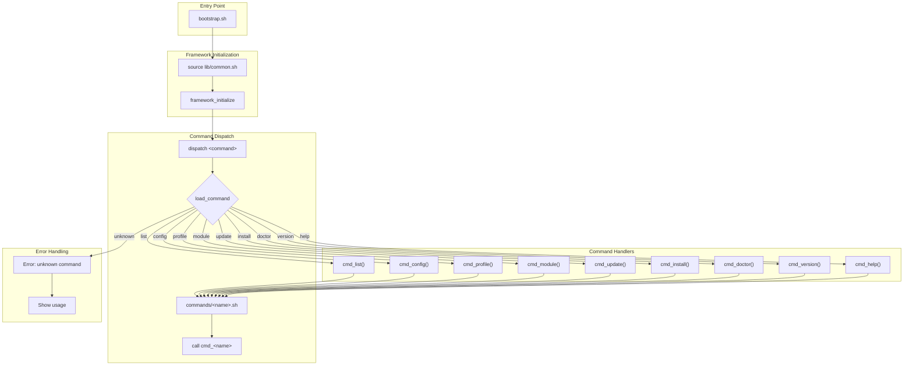
```mermaid
flowchart TB
    subgraph Entry["Entry Point"]
        A[bootstrap.sh]
    end

    subgraph Init["Framework Initialization"]
        B[source lib/common.sh]
        C[framework_initialize]
    end

    subgraph Dispatch["Command Dispatch"]
        D[dispatch &lt;command&gt;]
        E{load_command}
        F[commands/&lt;name&gt;.sh]
        G[call cmd_&lt;name&gt;]
    end

    subgraph Commands["Command Handlers"]
        H["cmd_help()"]
        I["cmd_version()"]
        J["cmd_doctor()"]
        K["cmd_install()"]
        L["cmd_update()"]
        M["cmd_module()"]
        N["cmd_profile()"]
        O["cmd_config()"]
        P["cmd_list()"]
    end

    subgraph Unknown["Error Handling"]
        Q[Error: unknown command]
        R[Show usage]
    end

    A --> B
    B --> C
    C --> D
    D --> E

    E -->|"help"| H
    E -->|"version"| I
    E -->|"doctor"| J
    E -->|"install"| K
    E -->|"update"| L
    E -->|"module"| M
    E -->|"profile"| N
    E -->|"config"| O
    E -->|"list"| P
    E -->|"unknown"| Q
    Q --> R

    H --> F
    I --> F
    J --> F
    K --> F
    L --> F
    M --> F
    N --> F
    O --> F
    P --> F

    F --> G
```

### Command Structure

Each command file in `commands/` exports a single function `cmd_<name>()`. The dispatcher:

1. Loads the command file via `load_command()`
2. Parses remaining arguments
3. Calls `cmd_<name> "$@"`

### Argument Parsing Detail

```mermaid
flowchart LR
    A["bootstrap.sh install --profile developer --dry-run"] --> B{[dispatch]}
    B -->|"install"| C[load_command install.sh]
    C --> D[cmd_install "$@"]

    subgraph cmd_install["cmd_install()"]
        E["Parse: install --profile developer --dry-run"]
        F{--profile?}
        G[installer_install_profile developer]
        H{--dry-run?}
        I[Enable dry-run mode]
        J[Preview installation]
        E --> F
        F -->|yes| G
        G --> H
        H -->|yes| I
        I --> J
        F -->|no| H
    end
```

### Legacy Global Options

| Flag | Purpose | Modern Equivalent |
|------|---------|-------------------|
| `--help` | Show help | `help` |
| `--version` | Show version | `version` |
| `--about` | Show project info | `version --about` |
| `--doctor` | Run diagnostics | `doctor` |
| `--profile <name>` | Install profile | `install --profile <name>` |
| `--module <name>` | Install module | `install --module <name>` |
| `--all` | Install all | `install --all` |
| `--list` | List profiles | `list profiles` |
| `--verbose` | Verbose output | `doctor --verbose` |
| `--debug` | Debug output | `LOG_LEVEL=DEBUG` |

---

## Module System

Modules are composable units of functionality stored in `packages/<category>/<name>.sh`. Each module exports a single function `install_<category>_<name>()`.

### Module Discovery

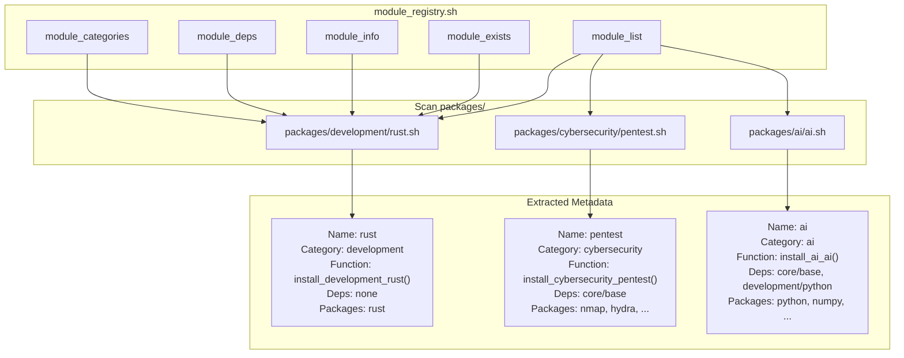
```mermaid
flowchart TB
    subgraph Registry["module_registry.sh"]
        A[module_list]
        B[module_exists]
        C[module_info]
        D[module_deps]
        E[module_categories]
    end

    subgraph Discovery["Scan packages/"]
        F["packages/development/rust.sh"]
        G["packages/cybersecurity/pentest.sh"]
        H["packages/ai/ai.sh"]
    end

    subgraph Metadata["Extracted Metadata"]
        I["Name: rust<br/>Category: development<br/>Function: install_development_rust()<br/>Deps: none<br/>Packages: rust"]
        J["Name: pentest<br/>Category: cybersecurity<br/>Function: install_cybersecurity_pentest()<br/>Deps: core/base<br/>Packages: nmap, hydra, ..."]
        K["Name: ai<br/>Category: ai<br/>Function: install_ai_ai()<br/>Deps: core/base, development/python<br/>Packages: python, numpy, ..."]
    end

    A --> F
    A --> G
    A --> H
    F --> I
    G --> J
    H --> K
    B --> F
    C --> F
    D --> F
    E --> F
```

### Module Loading

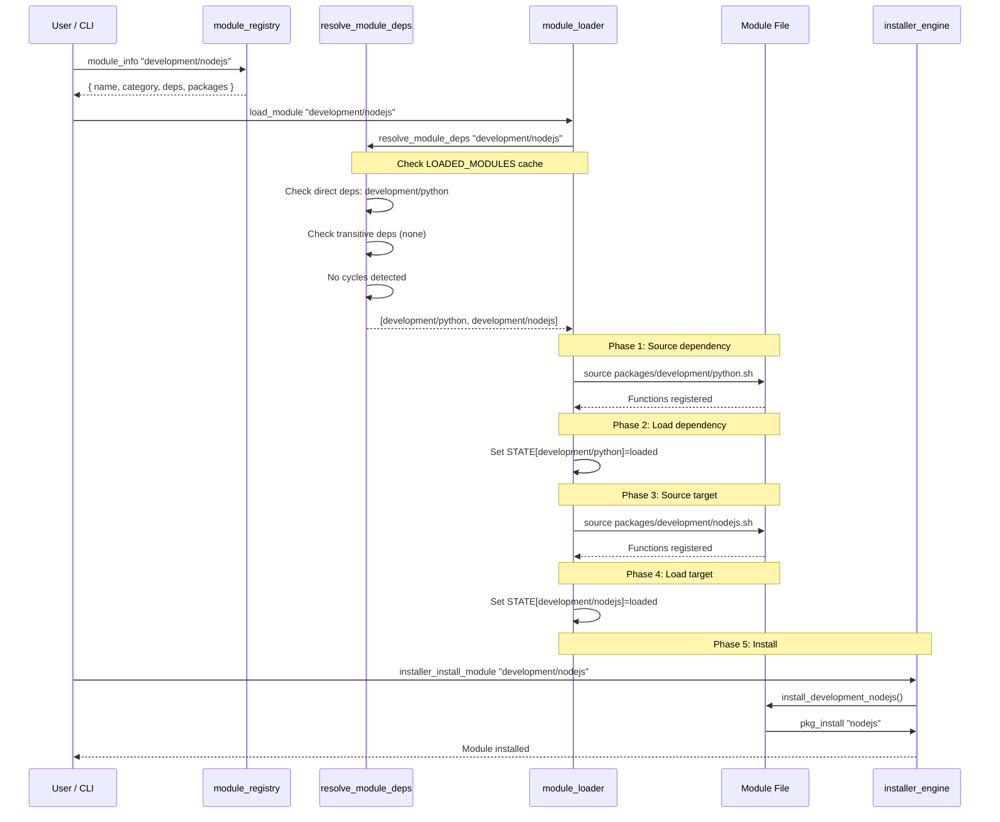
```mermaid
sequenceDiagram
    participant User as User / CLI
    participant Registry as module_registry
    participant Resolver as resolve_module_deps
    participant Loader as module_loader
    participant Module as Module File
    participant Engine as installer_engine

    User->>Registry: module_info "development/nodejs"
    Registry-->>User: { name, category, deps, packages }

    User->>Loader: load_module "development/nodejs"

    Loader->>Resolver: resolve_module_deps "development/nodejs"
    Note over Loader,Resolver: Check LOADED_MODULES cache

    Resolver->>Resolver: Check direct deps: development/python
    Resolver->>Resolver: Check transitive deps (none)
    Resolver->>Resolver: No cycles detected
    Resolver-->>Loader: [development/python, development/nodejs]

    Note over Loader,Module: Phase 1: Source dependency
    Loader->>Module: source packages/development/python.sh
    Module-->>Loader: Functions registered

    Note over Loader,Module: Phase 2: Load dependency
    Loader->>Loader: Set STATE[development/python]=loaded

    Note over Loader,Module: Phase 3: Source target
    Loader->>Module: source packages/development/nodejs.sh
    Module-->>Loader: Functions registered

    Note over Loader,Module: Phase 4: Load target
    Loader->>Loader: Set STATE[development/nodejs]=loaded

    Note over Loader,Engine: Phase 5: Install
    User->>Engine: installer_install_module "development/nodejs"
    Engine->>Module: install_development_nodejs()
    Module->>Engine: pkg_install "nodejs"
    Engine-->>User: Module installed
```

### Module State Machine

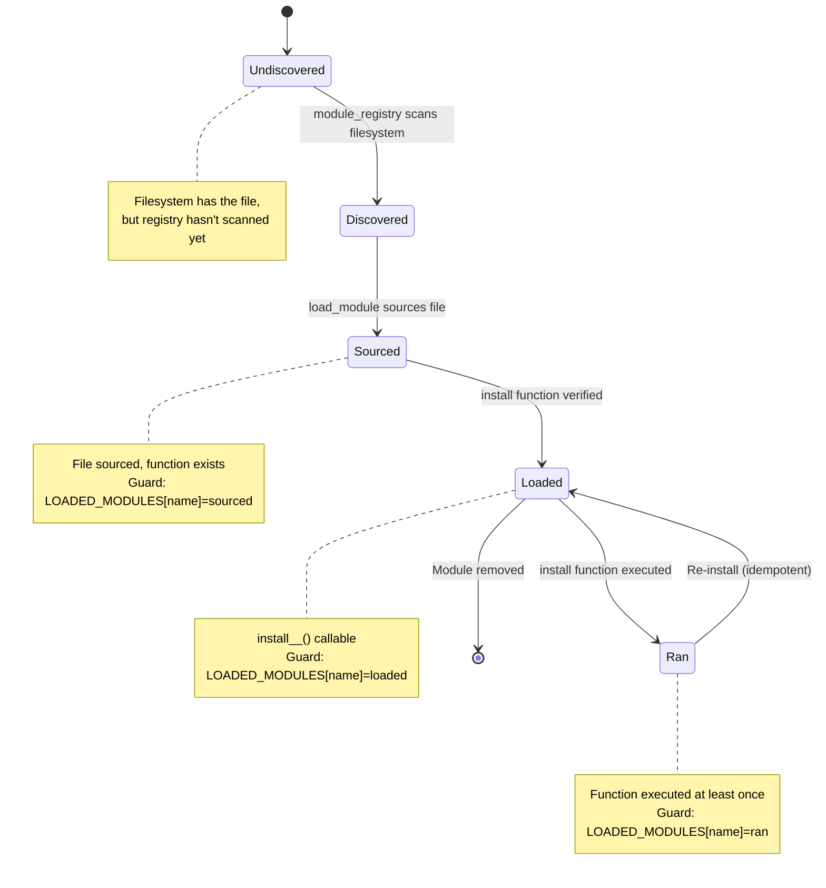
```mermaid
stateDiagram-v2
    [*] --> Undiscovered
    Undiscovered --> Discovered: module_registry scans filesystem
    Discovered --> Sourced: load_module sources file
    Sourced --> Loaded: install function verified
    Loaded --> Ran: install function executed
    Ran --> Loaded: Re-install (idempotent)
    Loaded --> [*]: Module removed

    note right of Undiscovered
        Filesystem has the file,
        but registry hasn't scanned yet
    end note
    note right of Sourced
        File sourced, function exists
        Guard: LOADED_MODULES[name]=sourced
    end note
    note right of Loaded
        install_<cat>_<name>() callable
        Guard: LOADED_MODULES[name]=loaded
    end note
    note right of Ran
        Function executed at least once
        Guard: LOADED_MODULES[name]=ran
    end note
```

---

## Dependency Resolution

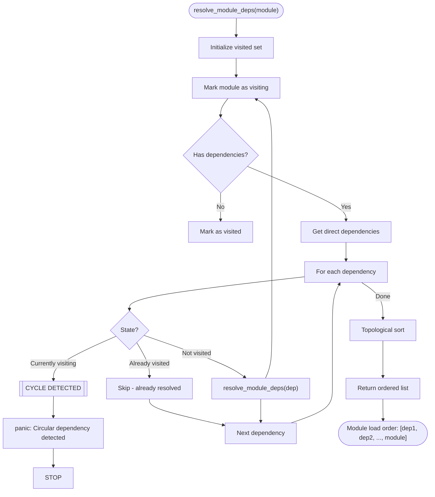
```mermaid
flowchart TB
    Start(["resolve_module_deps(module)"]) --> Init[Initialize visited set]
    Init --> Visit[Mark module as visiting]
    Visit --> Check{Has dependencies?}

    Check -->|No| Done[Mark as visited]
    Check -->|Yes| GetDeps[Get direct dependencies]

    GetDeps --> ForEach[For each dependency]
    ForEach --> State{State?}

    State -->|Already visited| Skip[Skip - already resolved]
    State -->|Currently visiting| Cycle[[CYCLE DETECTED]]
    State -->|Not visited| Recurse

    Cycle --> Error["panic: Circular dependency detected"]
    Error --> Stop[STOP]

    Recurse["resolve_module_deps(dep)"] --> Visit

    Skip --> Next[Next dependency]
    Recurse --> Next
    Next --> ForEach

    ForEach -->|Done| Sort
    Sort[Topological sort] --> Result[Return ordered list]
    Result --> Output(["Module load order: [dep1, dep2, ..., module]"])
```

### Dependency Graph Example

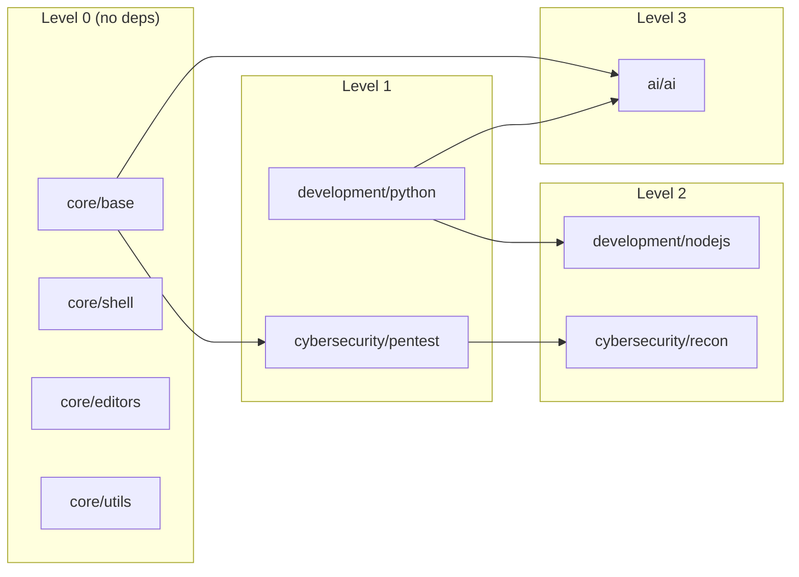
```mermaid
flowchart LR
    subgraph Level0["Level 0 (no deps)"]
        A["core/base"]
        B["core/shell"]
        C["core/editors"]
        D["core/utils"]
    end

    subgraph Level1["Level 1"]
        E["development/python"]
        F["cybersecurity/pentest"]
    end

    subgraph Level2["Level 2"]
        G["development/nodejs"]
        H["cybersecurity/recon"]
    end

    subgraph Level3["Level 3"]
        I["ai/ai"]
    end

    A --> F
    A --> I
    E --> G
    E --> I
    F --> H
```

**Resolved order for `ai/ai`:** `core/base` → `development/python` → `ai/ai`

**Resolved order for `development/nodejs`:** `development/python` → `development/nodejs`

### Cycle Detection

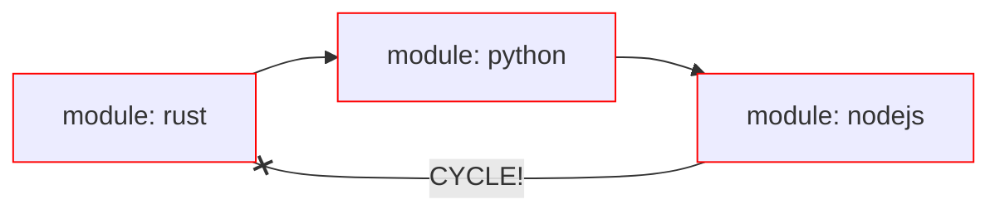
```mermaid
flowchart LR
    A["module: rust"] --> B["module: python"]
    B --> C["module: nodejs"]
    C --x|"CYCLE!"| A

    style A stroke:#f00
    style B stroke:#f00
    style C stroke:#f00
```

When a cycle is detected, `panic` is called with the cycle path, installation stops, and the user is shown which modules form the cycle.

---

## Installer Workflow

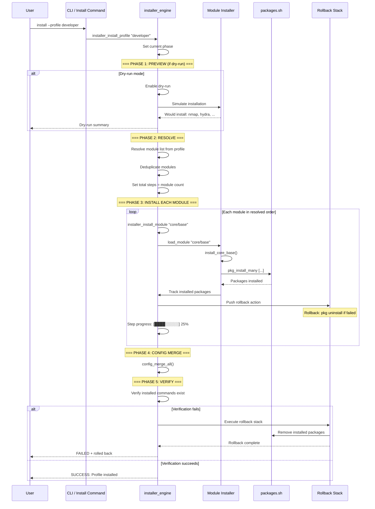
```mermaid
sequenceDiagram
    participant User
    participant CLI as CLI / Install Command
    participant Engine as installer_engine
    participant Module as Module Installer
    participant Pkg as packages.sh
    participant Rollback as Rollback Stack

    User->>CLI: install --profile developer
    CLI->>Engine: installer_install_profile "developer"
    Engine->>Engine: Set current phase

    Note over Engine: === PHASE 1: PREVIEW (if dry-run) ===

    alt Dry-run mode
        Engine->>Engine: Enable dry-run
        Engine->>Module: Simulate installation
        Module-->>Engine: Would install: nmap, hydra, ...
        Engine-->>User: Dry-run summary
    end

    Note over Engine: === PHASE 2: RESOLVE ===

    Engine->>Engine: Resolve module list from profile
    Engine->>Engine: Deduplicate modules
    Engine->>Engine: Set total steps = module count

    Note over Engine: === PHASE 3: INSTALL EACH MODULE ===

    loop Each module in resolved order
        Engine->>Engine: installer_install_module "core/base"
        Engine->>Module: load_module "core/base"
        Module->>Module: install_core_base()

        Module->>Pkg: pkg_install_many [...]
        Pkg-->>Module: Packages installed

        Module->>Engine: Track installed packages
        Engine->>Rollback: Push rollback action
        Note over Rollback: Rollback: pkg uninstall if failed

        Engine->>Engine: Step progress: [████░░░░░] 25%
    end

    Note over Engine: === PHASE 4: CONFIG MERGE ===

    Engine->>Engine: config_merge_all()

    Note over Engine: === PHASE 5: VERIFY ===

    Engine->>Engine: Verify installed commands exist
    alt Verification fails
        Engine->>Rollback: Execute rollback stack
        Rollback->>Pkg: Remove installed packages
        Rollback-->>Engine: Rollback complete
        Engine-->>User: FAILED + rolled back
    else Verification succeeds
        Engine-->>User: SUCCESS: Profile installed
    end
```

### Rollback Stack Detail

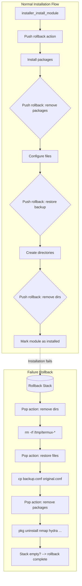
```mermaid
flowchart TB
    subgraph Installation["Normal Installation Flow"]
        A[installer_install_module] --> B[Push rollback action]
        B --> C[Install packages]
        C --> D{Push rollback: remove packages}
        D --> E[Configure files]
        E --> F{Push rollback: restore backup}
        F --> G[Create directories]
        G --> H{Push rollback: remove dirs}
        H --> I[Mark module as installed]
    end

    subgraph Rollback["Failure Rollback"]
        J[("Rollback Stack")]
        J --> K["Pop action: remove dirs"]
        K --> L["rm -rf /tmp/termux-*"]
        L --> M["Pop action: restore files"]
        M --> N["cp backup.conf original.conf"]
        N --> O["Pop action: remove packages"]
        O --> P["pkg uninstall nmap hydra ..."]
        P --> Q["Stack empty? --> rollback complete"]
    end

    I -.->|"Installation fails"| J
```

### Installer State

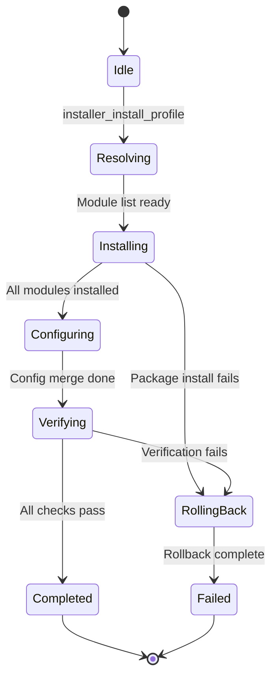
```mermaid
stateDiagram-v2
    [*] --> Idle
    Idle --> Resolving: installer_install_profile
    Resolving --> Installing: Module list ready
    Installing --> RollingBack: Package install fails
    Installing --> Configuring: All modules installed
    Configuring --> Verifying: Config merge done
    Verifying --> Completed: All checks pass
    Verifying --> RollingBack: Verification fails
    RollingBack --> Failed: Rollback complete
    Completed --> [*]
    Failed --> [*]
```

---

## Profile Execution

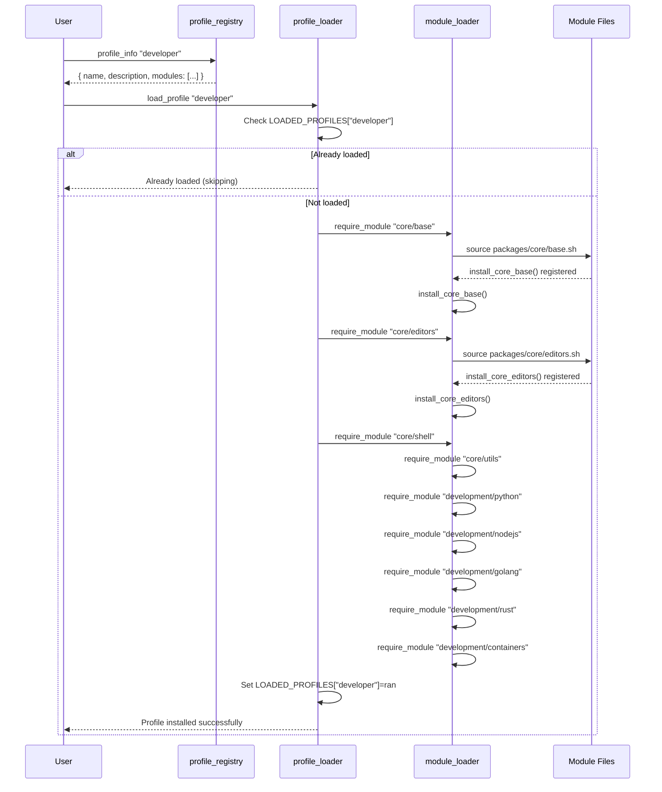
```mermaid
sequenceDiagram
    participant User
    participant Registry as profile_registry
    participant Loader as profile_loader
    participant MLoader as module_loader
    participant Module as Module Files

    User->>Registry: profile_info "developer"
    Registry-->>User: { name, description, modules: [...] }

    User->>Loader: load_profile "developer"

    Loader->>Loader: Check LOADED_PROFILES["developer"]
    alt Already loaded
        Loader-->>User: Already loaded (skipping)
    else Not loaded
        Loader->>MLoader: require_module "core/base"
        MLoader->>Module: source packages/core/base.sh
        Module-->>MLoader: install_core_base() registered
        MLoader->>MLoader: install_core_base()

        Loader->>MLoader: require_module "core/editors"
        MLoader->>Module: source packages/core/editors.sh
        Module-->>MLoader: install_core_editors() registered
        MLoader->>MLoader: install_core_editors()

        Loader->>MLoader: require_module "core/shell"
        MLoader->>MLoader: require_module "core/utils"
        MLoader->>MLoader: require_module "development/python"
        MLoader->>MLoader: require_module "development/nodejs"
        MLoader->>MLoader: require_module "development/golang"
        MLoader->>MLoader: require_module "development/rust"
        MLoader->>MLoader: require_module "development/containers"

        Loader->>Loader: Set LOADED_PROFILES["developer"]=ran
        Loader-->>User: Profile installed successfully
    end
```

### Profile Lifecycle

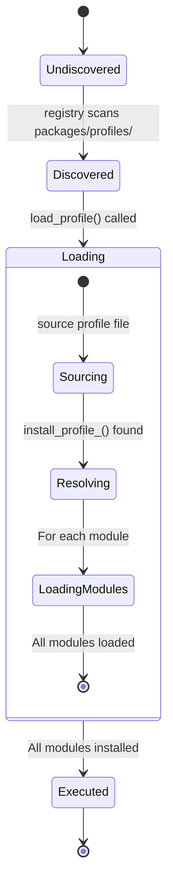
```mermaid
stateDiagram-v2
    [*] --> Undiscovered
    Undiscovered --> Discovered: registry scans packages/profiles/
    Discovered --> Loading: load_profile() called

    state Loading {
        [*] --> Sourcing: source profile file
        Sourcing --> Resolving: install_profile_<name>() found
        Resolving --> LoadingModules: For each module
        LoadingModules --> [*]: All modules loaded
    }

    Loading --> Executed: All modules installed
    Executed --> [*]
```

### Profile Composition Matrix

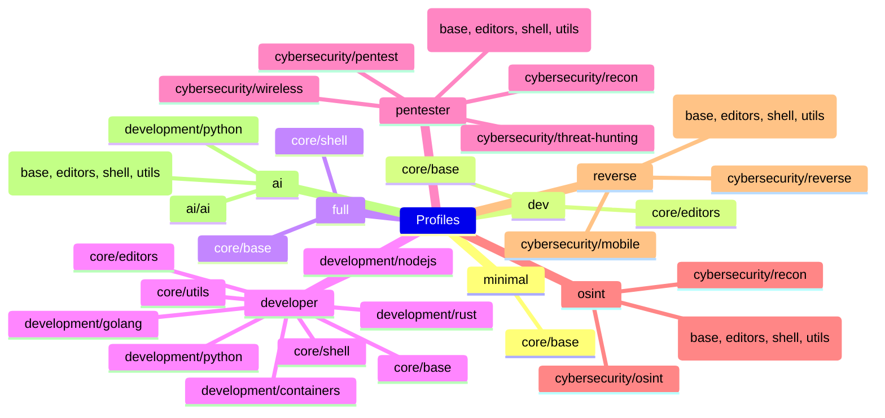
```mermaid
mindmap
  Profiles
    minimal
      core/base
    dev
      core/base
      core/editors
    full
      core/base
      core/shell
    developer
      core/base
      core/editors
      core/shell
      core/utils
      development/python
      development/nodejs
      development/golang
      development/rust
      development/containers
    pentester
      core/* (base, editors, shell, utils)
      cybersecurity/pentest
      cybersecurity/recon
      cybersecurity/wireless
      cybersecurity/threat-hunting
    osint
      core/* (base, editors, shell, utils)
      cybersecurity/osint
      cybersecurity/recon
    reverse
      core/* (base, editors, shell, utils)
      cybersecurity/reverse
      cybersecurity/mobile
    ai
      core/* (base, editors, shell, utils)
      development/python
      ai/ai
```

---

## Configuration Engine

### Config Path Resolution

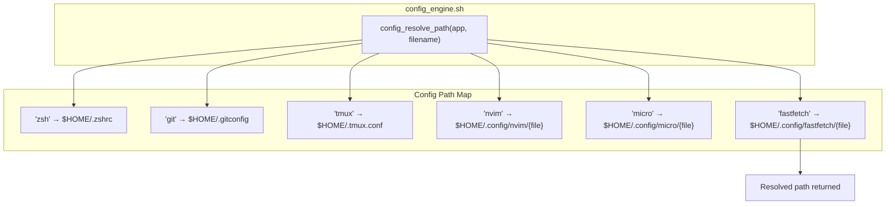
```mermaid
flowchart TB
    subgraph Engine["config_engine.sh"]
        A["config_resolve_path(app, filename)"]
    end

    subgraph PathMap["Config Path Map"]
        B["'zsh' → $HOME/.zshrc"]
        C["'git' → $HOME/.gitconfig"]
        D["'tmux' → $HOME/.tmux.conf"]
        E["'nvim' → $HOME/.config/nvim/{file}"]
        F["'micro' → $HOME/.config/micro/{file}"]
        G["'fastfetch' → $HOME/.config/fastfetch/{file}"]
    end

    A --> B
    A --> C
    A --> D
    A --> E
    A --> F
    A --> G

    G --> Resolved["Resolved path returned"]
```

### Config Merge Decision Flow

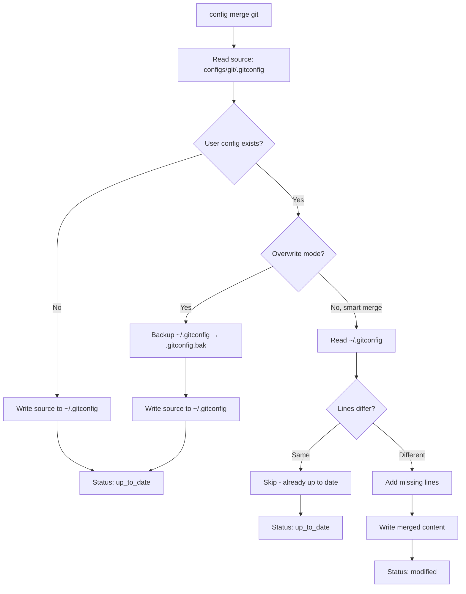
```mermaid
flowchart TB
    Request["config merge git"] --> Load["Read source: configs/git/.gitconfig"]
    Load --> Check{"User config exists?"}

    Check -->|No| Create["Write source to ~/.gitconfig"]
    Create --> Done["Status: up_to_date"]

    Check -->|Yes| Mode{"Overwrite mode?"}

    Mode -->|Yes| Backup["Backup ~/.gitconfig → .gitconfig.bak"]
    Backup --> Replace["Write source to ~/.gitconfig"]
    Replace --> Done

    Mode -->|No, smart merge| ReadExisting["Read ~/.gitconfig"]
    ReadExisting --> Diff{"Lines differ?"}

    Diff -->|Same| Skip["Skip - already up to date"]
    Skip --> Done2["Status: up_to_date"]

    Diff -->|Different| Merge["Add missing lines"]
    Merge --> Write["Write merged content"]
    Write --> Done3["Status: modified"]
```

### Config State Machine

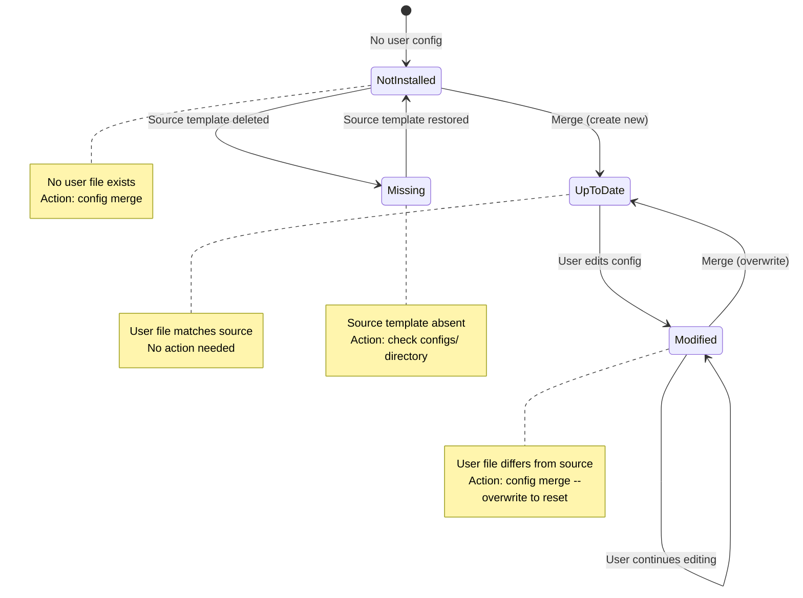
```mermaid
stateDiagram-v2
    [*] --> NotInstalled: No user config
    NotInstalled --> UpToDate: Merge (create new)

    UpToDate --> Modified: User edits config
    Modified --> UpToDate: Merge (overwrite)

    NotInstalled --> Missing: Source template deleted
    Missing --> NotInstalled: Source template restored

    Modified --> Modified: User continues editing

    note right of NotInstalled
        No user file exists
        Action: config merge
    end note
    note right of UpToDate
        User file matches source
        No action needed
    end note
    note right of Modified
        User file differs from source
        Action: config merge --overwrite to reset
    end note
    note right of Missing
        Source template absent
        Action: check configs/ directory
    end note
```

### Config Operations

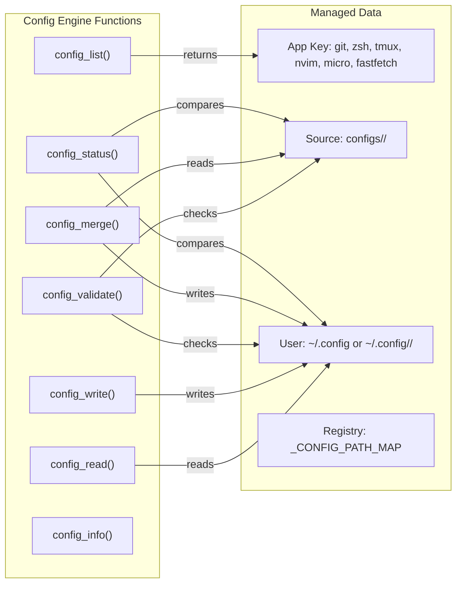
```mermaid
flowchart LR
    subgraph Operations["Config Engine Functions"]
        A["config_list()"]
        B["config_read()"]
        C["config_write()"]
        D["config_validate()"]
        E["config_merge()"]
        F["config_status()"]
        G["config_info()"]
    end

    subgraph Data["Managed Data"]
        H["App Key: git, zsh, tmux, nvim, micro, fastfetch"]
        I["Source: configs/<app>/<file>"]
        J["User: ~/.<app>config or ~/.config/<app>/"]
        K["Registry: _CONFIG_PATH_MAP"]
    end

    A -->|"returns"| H
    B -->|"reads"| J
    C -->|"writes"| J
    D -->|"checks"| I
    D -->|"checks"| J
    E -->|"reads"| I
    E -->|"writes"| J
    F -->|"compares"| I
    F -->|"compares"| J
```

---

## Logging System

### Log Call Flow

```mermaid
sequenceDiagram
    participant Caller as Any Function
    participant Logger as logging.sh
    participant Console as Terminal
    participant File as LOG_FILE

    Caller->>Logger: log_info "Installing module"

    Logger->>Logger: _timestamp()
    Note over Logger: Returns: 2026-07-03 10:30:45

    Logger->>Logger: _caller_info()
    Note over Logger: Uses BASH_SOURCE/BASH_LINENO
    Note over Logger: Returns: installer_engine.sh:42

    Logger->>Logger: _format_message()
    Note over Logger: "[2026-07-03 10:30:45] [INFO] [installer_engine.sh:42] Installing module"

    Logger->>Console: printf "%s" formatted_message

    Logger->>File: echo formatted_message >> $LOG_FILE

    Caller->>Logger: log_success "Module installed"
    Logger->>Console: print green "[ OK ]"
    Logger->>File: append to LOG_FILE

    Caller->>Logger: log_debug "Variable X = value"
    alt LOG_LEVEL == DEBUG
        Logger->>Console: print magenta "[DEBUG]"
        Logger->>File: append to LOG_FILE
    else LOG_LEVEL != DEBUG
        Note over Logger: SILENT - no output
    end
```

### Log Level Architecture

```mermaid
flowchart TB
    subgraph Levels["Log Levels (ascending severity)"]
        L1["DEBUG<br/>(magenta)"]
        L2["INFO<br/>(blue)"]
        L3["SUCCESS<br/>(green)"]
        L4["WARNING<br/>(yellow)"]
        L5["ERROR<br/>(red)"]
        L6["FATAL<br/>(red + exit)"]
    end

    subgraph Filter["Level Filter"]
        F["LOG_LEVEL variable<br/>Default: INFO"]
        F -->|"DEBUG"| ShowAll["Show all levels"]
        F -->|"INFO"| HideDebug["Hide DEBUG"]
        F -->|"WARNING"| HideInfo["Hide INFO, DEBUG"]
    end

    subgraph Output["Output Channels"]
        O1["Console (stdout)"]
        O2["LOG_FILE<br/>~/.local/share/.../logs/install.log"]
        O3["ERROR_LOG<br/>~/.local/share/.../logs/error.log"]
    end

    L1 --> F
    L2 --> F
    L3 --> F
    L4 --> F
    L5 --> F
    L6 --> F

    ShowAll --> O1
    ShowAll --> O2
    HideDebug -->|"INFO+"| O1
    HideDebug -->|"INFO+"| O2
    HideInfo -->|"WARNING+"| O1
    HideInfo -->|"WARNING+"| O2

    L5 --> O3
    L6 --> O3
```

### Log Format Breakdown

```mermaid
flowchart LR
    subgraph Entry["Log Entry Structure"]
        A["["]
        B["2026-07-03 10:30:45"]
        C["] ["]
        D["INFO"]
        E["]  ["]
        F["installer_engine.sh"]
        G[":"]
        H["42"]
        I["] "]
        J["Installing module: cybersecurity/pentest"]
    end

    A --- B --- C --- D --- E --- F --- G --- H --- I --- J

    B -->|"Timestamp"| B1["_timestamp()<br/>date '+%Y-%m-%d %H:%M:%S'"]
    D -->|"Level"| D1["Padded to 5 chars<br/>'INFO ' vs 'DEBUG'"]
    F -->|"Source File"| F1["BASH_SOURCE[1]"]
    H -->|"Line Number"| H1["BASH_LINENO[0]"]
    J -->|"Message"| J1["Provided by caller"]
```

---

## Error Handling

```mermaid
flowchart TB
    subgraph Framework["Error Framework<br/>lib/core/errors.sh"]
        Fatal["Fatal Functions"]
        Warn["Warning Functions"]
        Assert["Assertion Functions"]
        Signals["Signal Handlers"]
    end

    subgraph FatalGroup["Fatal"]
        A1["die()"]
        A2["panic()"]
        A3["log_fatal()"]
    end

    subgraph WarnGroup["Warning"]
        B1["warn()"]
        B2["success()"]
        B3["info()"]
        B4["debug()"]
    end

    subgraph AssertGroup["Assertions"]
        C1["assert_file(path)"]
        C2["assert_directory(path)"]
        C3["assert_command(cmd)"]
        C4["assert_capability(name)"]
        C5["assert_variable(name)"]
    end

    subgraph SignalGroup["Signals"]
        D1["on_interrupt()"]
        D2["on_error()"]
        D3["register_error_handlers()"]
    end

    Fatal --> FatalGroup
    Warn --> WarnGroup
    Assert --> AssertGroup
    Signals --> SignalGroup

    A1 -->|"log_error + exit EXIT_ERROR"| Exit
    A2 -->|"log_error + _stacktrace + exit EXIT_ERROR"| Exit
    A3 -->|"log_error + exit EXIT_FAILURE"| Exit

    C1 -->|"die if missing"| Missing
    C2 -->|"die if missing"| Missing
    C3 -->|"die if not found"| Missing
    C4 -->|"die if absent"| Missing
    C5 -->|"die if unset"| Missing

    D1 -->|"SIGINT → warn + exit 130"| Exit
    D2 -->|"ERR → panic"| A2

    Exit["Process Exit"]
    Missing["Error Message + Exit"]
```

### Exit Code Reference

| Code | Constant | Source |
|:----:|----------|--------|
| `0` | `EXIT_SUCCESS` | Normal completion |
| `1` | `EXIT_FAILURE` | General error |
| `2` | `EXIT_INVALID_ARGUMENT` | Bad CLI input |
| `3` | `EXIT_DEPENDENCY_ERROR` | Missing dependency |
| `4` | `EXIT_NETWORK_ERROR` | Network failure |
| `5` | `EXIT_PERMISSION_ERROR` | Permission denied |
| `130` | `EXIT_INTERRUPTED` | SIGINT (Ctrl+C) |

---

## Package Management

```mermaid
flowchart TB
    subgraph Callers["Module Install Functions"]
        A["install_development_rust()"]
        B["install_cybersecurity_pentest()"]
        C["install_ai_ai()"]
    end

    subgraph Wrappers["Abstraction Layer<br/>lib/system/packages.sh"]
        D["pkg_install(pkg)"]
        E["pkg_install_many(pkg...)"]
        F["install_if_missing(cmd, pkg)"]
        G["pip_install(pkg...)"]
        H["npm_install(pkg...)"]
        I["cargo_install(pkg...)"]
        J["go_install(path)"]
        K["pkg_is_installed(pkg)"]
        L["pkg_remove(pkg)"]
    end

    subgraph Backends["Underlying Package Managers"]
        M["pkg install -y"]
        N["pip install"]
        O["npm install -g"]
        P["cargo install"]
        Q["go install"]
    end

    A --> F
    A --> E
    B --> E
    C --> E
    C --> G

    E --> M
    F --> K
    F --> E
    G --> N
    H --> O
    I --> P
    J --> Q
```

### Package Installation Flow

```mermaid
flowchart TB
    Start["install_if_missing('rustc', 'rust')"] --> Check{"command -v rustc"}
    Check -->|"exists"| Skip["Skipping: rustc already installed"]
    Check -->|"not found"| Install["pkg_install 'rust'"]
    Install --> Result{"Success?"}
    Result -->|"yes"| LogOK["log_success: rust installed"]
    Result -->|"no"| LogFail["log_error: failed to install"]
```

---

## Testing Architecture

```mermaid
flowchart TB
    subgraph Runner["Test Runner"]
        R["tests/run_tests.sh"]
        R -->|"FORMAT=tap"| TAP["TAP Output"]
        R -->|"FORMAT=pretty"| Pretty["Pretty Output"]
        R -->|"JOBS=4"| Parallel["Parallel Execution"]
    end

    subgraph Categories["12 Test Categories"]
        FW["framework<br/>(4 files)"]
        CLI["cli<br/>(1 file)"]
        CF["config<br/>(1 file)"]
        LG["logging<br/>(1 file)"]
        MD["modules<br/>(3 files)"]
        PR["profiles<br/>(2 files)"]
        SY["system<br/>(2 files)"]
        TM["terminal<br/>(5 files)"]
        UT["utils<br/>(11 files)"]
        VL["validation<br/>(2 files)"]
        RG["regression<br/>(1 file)"]
        INT["integration<br/>(1 file)"]
    end

    subgraph Helpers["Test Helpers<br/>tests/helpers/"]
        H1["common.bash<br/>Setup/teardown, isolation"]
        H2["assertions.bash<br/>Custom assertions"]
        H3["fixtures.bash<br/>Temp modules/profiles"]
        H4["mocks.bash<br/>Mock pkg, pip, ..."]
        H5["filesystem.bash<br/>Temp dir management"]
    end

    R --> FW
    R --> CLI
    R --> CF
    R --> LG
    R --> MD
    R --> PR
    R --> SY
    R --> TM
    R --> UT
    R --> VL
    R --> RG
    R --> INT

    FW --> H1
    CLI --> H1
    CF --> H1
    LG --> H1
    MD --> H1
    PR --> H1
    SY --> H1
    TM --> H1
    UT --> H1
    VL --> H1
    RG --> H1
    INT --> H1

    subgraph Stats["Test Suite: 428 Tests, 0 Failures"]
        S1["35+ BATS files"]
        S2["5 helper libraries"]
        S3["Parallel execution capable"]
    end
```

### Test Isolation Architecture

```mermaid
flowchart TB
    subgraph PerTest["Per-Test Execution"]
        Setup["setup()"] --> Isolation["Isolation Layer"]
        Isolation --> Test["@test block"]
        Test --> Teardown["teardown()"]
    end

    subgraph IsolationLayer["Isolation Measures"]
        I1["Unset TERMUX_BOOTSTRAP_COMMON_LOADED"]
        I2["Unset ENVIRONMENT_INITIALIZED"]
        I3["Unset ERROR_HANDLERS_REGISTERED"]
        I4["Unset TEMP_CLEANUP_TRAP_SET"]
        I5["Create isolated TEST_TEMP_DIR"]
        I6["Suppress LOG_FILE creation"]
        I7["Reset shell options"]
    end

    subgraph FixturesLayer["Fixture Creation"]
        F1["create_test_module(cat, name)"]
        F2["create_test_profile(name)"]
        F3["create_fake_package(name)"]
    end

    Setup --> I1
    Setup --> I2
    Setup --> I3
    Setup --> I4
    Setup --> I5
    Setup --> I6

    Test --> F1
    Test --> F2
    Test --> F3

    Teardown --> T1["rm -rf TEST_TEMP_DIR"]
    Teardown --> T2["Restore environment"]
```

### Mock Framework

```mermaid
sequenceDiagram
    participant Test as Test
    participant Mock as mocks.bash
    participant Func as Tested Function
    participant Real as Real Command

    Test->>Mock: mock_command "pkg" "exit 0"
    Mock->>Mock: Backup /usr/bin/pkg
    Mock->>Mock: Create mock script → /usr/bin/pkg

    Test->>Func: call function that uses pkg
    Func->>Real: pkg install nmap
    Note over Real: Mock executes: exit 0
    Real-->>Func: Success (exit 0)

    Test->>Mock: restore_command "pkg"
    Mock->>Mock: Remove mock script
    Mock->>Mock: Restore original /usr/bin/pkg
```

---

## CI Pipeline

```mermaid
flowchart TB
    subgraph Triggers["Pipeline Triggers"]
        Push["git push<br/>to main/master/develop"]
        PR["pull_request<br/>opened/synchronize"]
        Schedule["cron: 0 3 * * *<br/>Nightly"]
        Release["release published<br/>or tag v*"]
    end

    subgraph Pipeline["Reusable Pipeline (ci-pipeline.yml)"]
        direction TB

        subgraph Lint["Job: Lint"]
            L1["Checkout"]
            L2["Install shellcheck + shfmt"]
            L3["bash -n syntax check<br/>all .sh files"]
            L4["shellcheck -x -s bash<br/>all .sh files"]
            L5["shfmt -d -i 8 -ci<br/>format check"]
        end

        subgraph Test["Job: Test"]
            T1["Checkout"]
            T2["Install BATS via npm"]
            T3["Run unit tests<br/>11 test directories"]
            T4["Run integration tests"]
            T5["Generate step summary"]
            T6["Upload test reports"]
        end

        subgraph Coverage["Job: Coverage"]
            C1["Checkout"]
            C2["Build kcov from source"]
            C3["Measure coverage<br/>for lib/ + modules/"]
            C4["50% quality gate<br/>(warn, not fail)"]
            C5["Upload coverage reports"]
        end

        subgraph Summary["Job: Pipeline Summary"]
            S1["Collect results"]
            S2["Generate summary"]
        end

        Lint --> Summary
        Test --> Summary
        Coverage --> Summary
    end

    Push --> Pipeline
    PR -->|"concurrency<br/>cancel-in-progress"| Pipeline
    Schedule --> Pipeline
    Release --> Pipeline

    subgraph ReleaseJob["Release Job (release.yml)"]
        R1["Create tar.gz archive"]
        R2["Generate sha256sum"]
        R3["Upload artifacts"]
    end

    Pipeline -->|"on release trigger"| ReleaseJob
```

### CI Workflow Details

```mermaid
flowchart LR
    subgraph Push["ci.yml"]
        P["Push to main"] --> P1["calls ci-pipeline"]
    end

    subgraph PR["pr.yml"]
        PR1["PR opened/sync"] --> PR2["calls ci-pipeline"]
        PR2 --> PR3["auto-cancel duplicates"]
    end

    subgraph Nightly["nightly.yml"]
        N["3:00 AM UTC"] --> N1["ShellCheck all files"]
        N1 --> N2["Extended BATS tests"]
        N2 --> N3["Performance baseline"]
        N3 --> N4["30-day artifact retention"]
    end

    subgraph ReleaseJob["release.yml"]
        R["Git tag / release"] --> R1["calls ci-pipeline"]
        R1 --> R2["Package archive"]
        R2 --> R3["Upload + checksums"]
    end
```

### CI Pipeline Flow

```mermaid
sequenceDiagram
    participant Git as GitHub
    participant Lint as Lint Job
    participant Test as Test Job
    participant Cov as Coverage Job
    participant Sum as Summary

    Git->>Lint: Trigger workflow
    Note over Lint: ubuntu-24.04

    Lint->>Lint: Shell syntax validation
    Lint->>Lint: ShellCheck (83 .sh files)
    Lint->>Lint: shfmt format check

    alt Lint fails
        Lint-->>Git: ❌ Lint failed
    else Lint passes
        Lint-->>Git: ✅ Lint passed
    end

    par Jobs run in parallel
        Git->>Test: Start test job
        Test->>Test: Unit tests (11 categories)
        Test->>Test: Integration tests
        Test-->>Git: ✅/❌ Test results

    and
        Git->>Cov: Start coverage job
        Cov->>Cov: kcov build
        Cov->>Cov: Measure coverage
        Cov->>Cov: Check quality gate
        Cov-->>Git: ✅/❌ Coverage report
    end

    Git->>Sum: After all jobs complete
    Sum->>Sum: Aggregate results
    Sum-->>Git: Pipeline summary
```

### Artifact Flow

```mermaid
flowchart TB
    subgraph TestArtifacts["Test Job Artifacts"]
        T1["test-reports/"]
        T2["/tmp/bats-test-*.txt"]
    end

    subgraph CoverageArtifacts["Coverage Job Artifacts"]
        C1["coverage-output/<br/>kcov JSON + HTML"]
    end

    subgraph ReleaseArtifacts["Release Job Artifacts"]
        R1["termux-bootstrap-*.tar.gz"]
        R2["checksums.txt<br/>(sha256)"]
    end

    Test -->|"upload-artifact@v4<br/>retention: 14 days"| TestArtifacts
    Coverage -->|"upload-artifact@v4<br/>retention: 14 days"| CoverageArtifacts
    Release -->|"upload-artifact@v4<br/>retention: 90 days"| ReleaseArtifacts
```

---

## Design Decisions

### Why Bash?

Termux runs on Android with limited resources. Bash requires no runtime, no compiler, and is available on every Termux installation by default. A Bash framework has zero bootstrapping cost.

### Why a Central Loader?

`lib/common.sh` uses a God Object pattern to load all libraries. This ensures:
- Deterministic initialization order
- Single entry point `framework_initialize()`
- No hidden dependencies or race conditions
- Easy to audit what is loaded

### Why Dynamic Discovery?

Modules and profiles are discovered by scanning `packages/` at runtime rather than being registered in a central manifest. This means:
- Adding a module requires only creating a file
- No registration step needed
- The filesystem is the source of truth

### Why BATS?

BATS (Bash Automated Testing System) is the de facto standard for testing Bash scripts. It integrates with the TAP protocol, supports TDD workflows, and runs on Termux.

### Why Separate Registry and Loader?

Separation of concerns: the registry answers metadata questions (list, exists, info, deps) without side effects. The loader performs stateful operations (source, init, run). This makes the registry safe to call from interactive help and autocompletion without triggering installations.
