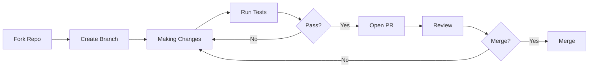

# Contributing

> Thank you for considering contributing to Termux Bootstrap! This document outlines the process, standards, and expectations.

---

## Table of Contents

- [Code of Conduct](#code-of-conduct)
- [How to Contribute](#how-to-contribute)
- [Development Setup](#development-setup)
- [Code Standards](#code-standards)
- [Pull Request Process](#pull-request-process)
- [Commit Conventions](#commit-conventions)
- [Issue Reporting](#issue-reporting)
- [Feature Requests](#feature-requests)
- [Documentation](#documentation)

---

## Code of Conduct

### Our Pledge

We pledge to make participation in this project a harassment-free experience for everyone, regardless of age, body size, disability, ethnicity, gender identity, experience level, nationality, or religion.

### Our Standards

- **Be respectful** — Disagreement is fine, personal attacks are not
- **Be constructive** — Offer solutions, not just criticism
- **Be patient** — Maintainers are volunteers with limited time
- **Be inclusive** — Welcome newcomers and diverse perspectives

### Enforcement

Violations can be reported to the project maintainers. All reports will be reviewed and investigated.

---

## How to Contribute

### Areas for Contribution

- **Bug fixes** — Issues labeled `bug`
- **New modules** — Package definitions for additional tools
- **New profiles** — Profile compositions for new use cases
- **Documentation** — Improvements to any documentation file
- **Test coverage** — Additional test cases or categories
- **Performance** — Optimizations to framework loading or execution
- **Refactoring** — Code quality improvements

### Contribution Workflow



---

## Development Setup

```bash
# Fork and clone
git clone https://github.com/<your-username>/termux-bootstrap.git
cd termux-bootstrap

# Add upstream remote
git remote add upstream https://github.com/0xSECsh/termux-bootstrap.git

# Install development dependencies
pkg install shellcheck shfmt bats jq

# Run the test suite to verify
./tests/run_tests.sh
```

---

## Code Standards

All contributions must comply with:

### Mandatory Checks

Before submitting, run:

```bash
# 1. Shell syntax check
find . -name '*.sh' -not -path './.git/*' -exec bash -n {} +

# 2. ShellCheck linting
find . -name '*.sh' -not -path './.git/*' -exec shellcheck -x -s bash {} +

# 3. shfmt formatting
find . -name '*.sh' -not -path './.git/*' -exec shfmt -d -i 8 -ci {} +

# 4. Full test suite
./tests/run_tests.sh
```

### Coding Style

See [DEVELOPMENT.md](DEVELOPMENT.md#code-standards) for the complete style guide. Key points:

- 8-space indentation, no tabs
- `[[ ]]` over `[ ]` for conditionals
- Quote all variables unless intentionally unquoted
- Prefer `printf` over `echo`
- Use `local` for all function-scoped variables
- Avoid unnecessary subshells
- Functions must be single-responsibility

### Library Rules

- Define functions only — never execute code at source time
- Never call `pkg`, `pip`, `npm`, `cargo`, or `go` directly
- Never use `exit 1` — use `die` or `panic` from the error framework
- Never print operational messages — use the logging library

---

## Pull Request Process

### Step 1: Create an Issue

For significant changes, open an issue first to discuss the approach. This avoids wasted effort on rejected implementations.

### Step 2: Create a Branch

```bash
git checkout -b feature/my-feature
# or
git checkout -b fix/my-bug-fix
```

### Step 3: Make Changes

- Write or update tests first (TDD preferred)
- Implement the change
- Verify all tests pass
- Update documentation if needed

### Step 4: Commit

```bash
git add <files>
git commit -m "feat(scope): concise description"
```

See [Commit Conventions](#commit-conventions) below.

### Step 5: Push and Open PR

```bash
git push origin feature/my-feature
```

Then open a pull request on GitHub.

### Step 6: Review

- Maintainers will review your PR
- Address feedback with additional commits
- Once approved, a maintainer will merge

### PR Checklist

```markdown
- [ ] Tests added/updated and passing
- [ ] ShellCheck clean (no warnings or errors)
- [ ] shfmt formatted (8-space indent, ci style)
- [ ] Documentation updated (if applicable)
- [ ] Commit message follows conventions
- [ ] Branch is up to date with main
```

---

## Commit Conventions

We use [Conventional Commits](https://www.conventionalcommits.org/).

### Format

```
<type>(<scope>): <description>

[optional body]

[optional footer]
```

### Types

| Type | When to Use |
|------|-------------|
| `feat` | New feature or module |
| `fix` | Bug fix |
| `refactor` | Code change with no behavior change |
| `test` | Adding or updating tests |
| `docs` | Documentation only |
| `style` | Formatting, linting |
| `chore` | Maintenance, dependencies, CI |

### Scopes

| Scope | When to Use |
|-------|-------------|
| `core` | Core library changes |
| `module` | Module definitions |
| `profile` | Profile definitions |
| `cli` | CLI command changes |
| `config` | Configuration engine |
| `test` | Test infrastructure |
| `docs` | Documentation |
| `ci` | CI/CD pipeline |
| `deps` | Dependencies |

### Examples

```
feat(module): add cybersecurity/threat-hunting module
fix(core): resolve circular dependency detection
refactor(config): extract path resolution logic
test(cli): add dispatcher tests for unknown commands
docs(profile): add researcher profile documentation
ci: add nightly build workflow
```

---

## Issue Reporting

### Bug Reports

When reporting a bug, include:

1. **Environment**: Termux version, Android version, device model
2. **Reproduction steps**: Exact commands run
3. **Expected behavior**: What should happen
4. **Actual behavior**: What actually happens
5. **Logs**: Relevant output from `install.log` and `error.log`
6. **Screenshots**: If applicable

### Bug Report Template

```markdown
## Description
[Clear description of the bug]

## Reproduction
1. Run: `./bootstrap.sh install --profile developer`
2. ...

## Expected
[What should happen]

## Actual
[What happens instead]

## Environment
- Termux Bootstrap version: v0.1.0
- Termux version: [from termux-info]
- Android: [version]
- Device: [model]

## Logs
[Relevant log output]
```

---

## Feature Requests

When requesting a feature, include:

1. **Use case** — What problem does this solve?
2. **Proposed solution** — How should it work?
3. **Alternative approaches** — What else did you consider?
4. **Scope** — Is this a new module, profile, or framework change?

### Feature Request Template

```markdown
## Problem
[What problem does this feature solve?]

## Proposed Solution
[How should it work?]

## Alternative Approaches
[What else did you consider?]

## Scope
- [ ] New module
- [ ] New profile
- [ ] Framework change
- [ ] CLI command
- [ ] Documentation

## Additional Context
[Any other information]
```

---

## Documentation

### When to Update Docs

Update documentation when:

- Adding or modifying a CLI command
- Adding or modifying a module
- Adding or modifying a profile
- Changing configuration behavior
- Changing the initialization flow
- Adding or changing test infrastructure

### Documentation Standards

- Use GitHub-Flavored Markdown
- Include a table of contents for documents over 100 lines
- Use fenced code blocks with language identifiers
- Use mermaid for diagrams (sequence, flowchart)
- Keep line length under 100 characters
- Use consistent header hierarchy (H1 → H2 → H3)
