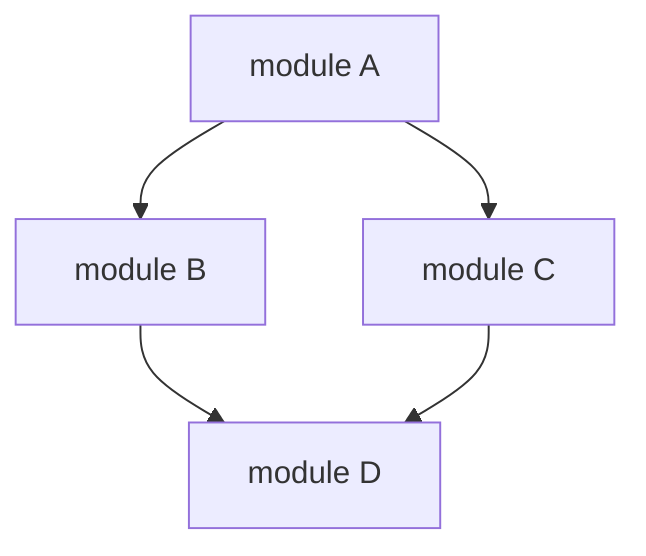

# Module Reference

> Complete reference for all Termux Bootstrap modules, their dependencies, packages, and extension APIs.

---

## Table of Contents

- [What are Modules?](#what-are-modules)
- [Module Categories](#module-categories)
- [Core Modules](#core-modules)
- [Development Modules](#development-modules)
- [Cybersecurity Modules](#cybersecurity-modules)
- [AI Module](#ai-module)
- [Module Lifecycle](#module-lifecycle)
- [Package Manifest](#package-manifest)
- [Creating Modules](#creating-modules)

---

## What are Modules?

Modules are the atomic unit of functionality in Termux Bootstrap. Each module:

- Installs a coherent set of packages
- Declares dependencies on other modules
- Exports a single install function
- Lives in `packages/<category>/<name>.sh`

### Module Convention

Every module file follows this convention:

```bash
# packages/<category>/<name>.sh
# Description: One-line description of what this module provides

install_<category>_<name>() {
    # Package array
    local -n packages="packages_${category}_${name}"
    
    # Install packages
    install_if_missing "<command>" "<pkg_name>"
    pkg_install_many "${packages[@]}"
}
```

---

## Module Categories

Modules are organized into 5 categories:

| Category | Directory | Focus | Count |
|----------|-----------|-------|-------|
| Core | `packages/core/` | Base system packages | 4 |
| Development | `packages/development/` | Languages and tooling | 5 |
| Cybersecurity | `packages/cybersecurity/` | Security tools | 7 |
| AI | `packages/ai/` | AI/ML packages | 1 |
| Profiles | `packages/profiles/` | Profile definitions (not modules) | - |

---

## Core Modules

### core/base

| Property | Value |
|----------|-------|
| **File** | `packages/core/base.sh` |
| **Function** | `install_core_base()` |
| **Dependencies** | None |

**Packages:** (stub — to be populated)

Provides the foundational system packages that every profile depends on.

### core/editors

| Property | Value |
|----------|-------|
| **File** | `packages/core/editors.sh` |
| **Function** | `install_core_editors()` |
| **Dependencies** | None |

**Packages:** (stub — to be populated)

Installs text editors and development tools.

### core/shell

| Property | Value |
|----------|-------|
| **File** | `packages/core/shell.sh` |
| **Function** | `install_core_shell()` |
| **Dependencies** | None |

**Packages:** (stub — to be populated)

Configures shell environment, prompt, and utilities.

### core/utils

| Property | Value |
|----------|-------|
| **File** | `packages/core/utils.sh` |
| **Function** | `install_core_utils()` |
| **Dependencies** | None |

**Packages:** (stub — to be populated)

Installs general-purpose utilities.

---

## Development Modules

### development/python

| Property | Value |
|----------|-------|
| **File** | `packages/development/python.sh` |
| **Function** | `install_development_python()` |
| **Dependencies** | None |

**Packages:** (stub — to be populated)

Installs Python runtime, pip, and core development libraries.

### development/nodejs

| Property | Value |
|----------|-------|
| **File** | `packages/development/nodejs.sh` |
| **Function** | `install_development_nodejs()` |
| **Dependencies** | `development/python` |

**Packages:** (stub — to be populated)

Installs Node.js runtime and npm.

### development/rust

| Property | Value |
|----------|-------|
| **File** | `packages/development/rust.sh` |
| **Function** | `install_development_rust()` |
| **Dependencies** | None |

**Packages:** `rust`

Installs Rust toolchain via pkg, including rustc and cargo.

### development/golang

| Property | Value |
|----------|-------|
| **File** | `packages/development/golang.sh` |
| **Function** | `install_development_golang()` |
| **Dependencies** | None |

**Packages:** `golang`

Installs Go compiler and toolchain.

### development/containers

| Property | Value |
|----------|-------|
| **File** | `packages/development/containers.sh` |
| **Function** | `install_development_containers()` |
| **Dependencies** | None |

**Packages:** `docker`, `podman`

Installs container runtimes for local development and testing.

---

## Cybersecurity Modules

### cybersecurity/pentest

| Property | Value |
|----------|-------|
| **File** | `packages/cybersecurity/pentest.sh` |
| **Function** | `install_cybersecurity_pentest()` |
| **Dependencies** | `core/base` |

**Packages:**

| Package | Purpose |
|---------|---------|
| `nmap` | Network discovery and port scanning |
| `hydra` | Password brute-force testing |
| `sqlmap` | SQL injection detection |
| `metasploit` | Exploitation framework |
| `nikto` | Web server scanner |
| `gobuster` | Directory/file brute-force |
| `wfuzz` | Web application fuzzer |
| `john` | Password cracking |
| `hashcat` | GPU-accelerated hash cracking |
| `netcat-openbsd` | Network piping and debugging |
| `socat` | Multipurpose relay |

### cybersecurity/recon

| Property | Value |
|----------|-------|
| **File** | `packages/cybersecurity/recon.sh` |
| **Function** | `install_cybersecurity_recon()` |
| **Dependencies** | None |

**Packages:**

| Package | Purpose |
|---------|---------|
| `subfinder` | Subdomain discovery |
| `httpx` | HTTP probing and analysis |
| `nuclei` | Vulnerability scanner |
| `naabu` | Port scanning |
| `dnsx` | DNS enumeration |
| `assetfinder` | Asset discovery |
| `amass` | Attack surface mapping |

### cybersecurity/osint

| Property | Value |
|----------|-------|
| **File** | `packages/cybersecurity/osint.sh` |
| **Function** | `install_cybersecurity_osint()` |
| **Dependencies** | None |

**Packages:**

| Package | Purpose |
|---------|---------|
| `recon-ng` | Web reconnaissance framework |
| `sherlock` | Social media username search |
| `holehe` | Email-to-account mapping |
| `maigret` | Advanced username search |
| `photon` | OSINT web crawler |

### cybersecurity/reverse

| Property | Value |
|----------|-------|
| **File** | `packages/cybersecurity/reverse.sh` |
| **Function** | `install_cybersecurity_reverse()` |
| **Dependencies** | None |

**Packages:**

| Package | Purpose |
|---------|---------|
| `radare2` | Reverse engineering framework |
| `gdb` | GNU debugger |
| `strace` | System call tracer |
| `ltrace` | Library call tracer |

### cybersecurity/wireless

| Property | Value |
|----------|-------|
| **File** | `packages/cybersecurity/wireless.sh` |
| **Function** | `install_cybersecurity_wireless()` |
| **Dependencies** | None |

**Packages:**

| Package | Purpose |
|---------|---------|
| `aircrack-ng` | Wireless security assessment |
| `reaver` | WPS attack tool |
| `wifite` | Automated wireless auditor |
| `bettercap` | MITM framework |
| `pixiewps` | WPS offline brute-force |

### cybersecurity/threat-hunting

| Property | Value |
|----------|-------|
| **File** | `packages/cybersecurity/threat-hunting.sh` |
| **Function** | `install_cybersecurity_threat_hunting()` |
| **Dependencies** | None |

**Packages:**

| Package | Purpose |
|---------|---------|
| `yara` | Malware pattern matching |
| `volatility3` | Memory forensics |
| `capa` | Capability detection in binaries |

### cybersecurity/mobile

| Property | Value |
|----------|-------|
| **File** | `packages/cybersecurity/mobile.sh` |
| **Function** | `install_cybersecurity_mobile()` |
| **Dependencies** | None |

**Packages:**

| Package | Purpose |
|---------|---------|
| `apktool` | APK reverse engineering |
| `jadx` | Dalvik bytecode decompiler |
| `dex2jar` | DEX to JAR converter |

---

## AI Module

### ai/ai

| Property | Value |
|----------|-------|
| **File** | `packages/ai/ai.sh` |
| **Function** | `install_ai_ai()` |
| **Dependencies** | `core/base`, `development/python` |

**Packages:**

| Package | Purpose |
|---------|---------|
| `python` | Python runtime |
| `python-pip` | Python package manager |
| `python-numpy` | Numerical computing |
| `clblast` | OpenCL BLAS |
| `openblas` | Optimized BLAS |

---

## Module Lifecycle


### Phase 1: Discovery

The `module_registry` scans `packages/` to find available modules. This phase is metadata-only — no files are sourced.

**Query functions:**

| Function | Returns |
|----------|---------|
| `module_list()` | Module names with descriptions |
| `module_exists()` | Boolean |
| `module_info()` | Full metadata |
| `module_deps()` | Dependency list |
| `module_categories()` | Category list |
| `module_count()` | Integer |

### Phase 2: Sourcing

The `module_loader` sources the module file, making its install function available.

### Phase 3: Dependency Resolution

Dependencies are resolved recursively with cycle detection:



Result: `D → B → C → A`

### Phase 4: Loading

Each module's install function is verified (exists, is callable). The module state is set to "loaded."

### Phase 5: Installation

The `installer_engine` executes the install function:

1. Push to rollback stack
2. Install packages via `packages.sh`
3. Execute module-specific setup
4. Track installed state
5. On failure: execute rollback (if enabled)

### Phase 6: Verification

Post-installation checks confirm:

- Required commands are available
- Packages are installed
- Configurations are in place

---

## Package Manifest

### Understanding Module Structure

```bash
# packages/development/rust.sh
# Description: Rust programming language toolchain

install_development_rust() {
    # Declare packages
    local -a packages
    packages=(
        "rust"          # Rust compiler and cargo
    )
    
    # Install system packages
    pkg_install_many "${packages[@]}"
    
    # Verify installation
    log_info "Rust $(rustc --version) installed"
}
```

### Package Manager Wrappers

| Function | Manages | Example |
|----------|---------|---------|
| `pkg_install_many` | System packages | `pkg_install_many nmap hydra sqlmap` |
| `install_if_missing` | Any command | `install_if_missing "rustc" "rust"` |
| `pip_install` | Python packages | `pip_install numpy pandas` |
| `npm_install` | Node packages | `npm_install typescript` |
| `cargo_install` | Rust crates | `cargo_install ripgrep` |
| `go_install` | Go modules | `go_install github.com/xxx` |

---

## Creating Modules

### Step-by-Step

**1. Create the module file:**

```bash
touch packages/<category>/<name>.sh
```

**2. Define the install function:**

```bash
# packages/development/my-tools.sh
# Description: Custom development tools

install_development_my_tools() {
    local -a packages
    packages=("tool1" "tool2" "tool3")
    
    log_info "Installing my-tools..."
    pkg_install_many "${packages[@]}"
    log_success "my-tools installed"
}
```

**3. Add dependencies (if any):**

Create a `depends` function or add metadata:

```bash
# Dependencies are declared in the install function or
# via a separate metadata function:
install_development_my_tools_depends() {
    echo "development/python"
    echo "development/rust"
}
```

**4. (Optional) Add to a profile:**

```bash
# In packages/profiles/developer.sh
install_profile_developer() {
    load_module "development/python"
    load_module "development/rust"
    load_module "development/my-tools"  # Add new module
}
```

### Module Naming Conventions

- **Use lowercase** with hyphens for multi-word names
- **Category directory** matches the grouping
- **Install function** follows `install_<category>_<name>()`
- **File name** matches the module name

### Best Practices

1. **Keep modules focused** — One coherent capability per module
2. **Declare all dependencies** — The resolver needs accurate information
3. **Use framework wrappers** — Never call `pkg`, `pip`, etc. directly
4. **Add verification** — Check that key commands exist after installation
5. **Log progress** — Use `log_info`, `log_success`, etc.
6. **Make it idempotent** — Running twice should be safe
