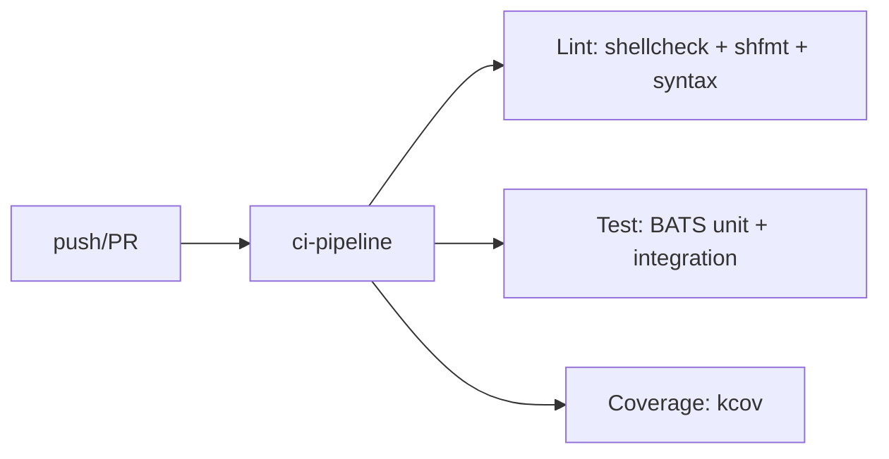

# Testing Guide

> How to run, write, and maintain tests for Termux Bootstrap.

---

## Table of Contents

- [Test Architecture](#test-architecture)
- [Running Tests](#running-tests)
- [Test Categories](#test-categories)
- [Test Helpers](#test-helpers)
- [Writing Tests](#writing-tests)
- [Test Isolation](#test-isolation)
- [Continuous Integration](#continuous-integration)
- [Coverage](#coverage)
- [Best Practices](#best-practices)

---

## Test Architecture

Termux Bootstrap uses **BATS** (Bash Automated Testing System) as its testing framework. The test suite contains **428 tests** across **12 categories** with **0 failures**.

```
tests/
├── run_tests.sh              # Test runner
├── helpers/
│   ├── assertions.bash        # Custom assertions
│   ├── common.bash            # Setup/teardown
│   ├── fixtures.bash          # Module/profile fixtures
│   ├── filesystem.bash        # Temp directory helpers
│   └── mocks.bash             # Mock framework
├── cli/
├── config/
├── framework/
├── integration/
├── logging/
├── modules/
├── profiles/
├── regression/
├── system/
├── terminal/
├── utils/
└── validation/
```

### Framework

BATS 1.11+ provides:

- **`setup()` / `teardown()`** — Per-test setup/teardown
- **`@test`** — Test case declaration
- **`run`** — Execute command and capture output
- **`assert_success` / `assert_failure`** — Exit code assertions
- **`assert_output` / `assert_line`** — Output assertions
- **`skip`** — Conditional test skipping

---

## Running Tests

### Prerequisites

```bash
# Install BATS
npm install -g bats
# or
pkg install bats
```

### Run All Tests

```bash
# Using the test runner
./tests/run_tests.sh

# Directly with BATS
bats tests/
```

### Run Specific Categories

```bash
# Framework tests
./tests/run_tests.sh framework

# Utils tests
./tests/run_tests.sh utils

# Integration tests
./tests/run_tests.sh integration
```

Available categories:

| Category | Command | Test Count |
|----------|---------|:----------:|
| All | `run_tests.sh all` | 428 |
| Framework | `run_tests.sh framework` | ~40 |
| CLI | `run_tests.sh cli` | ~30 |
| Config | `run_tests.sh config` | ~50 |
| Logging | `run_tests.sh logging` | ~25 |
| Modules | `run_tests.sh modules` | ~60 |
| Profiles | `run_tests.sh profiles` | ~20 |
| System | `run_tests.sh system` | ~20 |
| Terminal | `run_tests.sh terminal` | ~40 |
| Utils | `run_tests.sh utils` | ~80 |
| Validation | `run_tests.sh validation` | ~30 |
| Regression | `run_tests.sh regression` | ~15 |
| Integration | `run_tests.sh integration` | ~15 |

### Run Single Test Files

```bash
# Run a specific test file
bats tests/utils/cache.bats

# Run multiple files
bats tests/utils/string.bats tests/utils/hash.bats
```

### Output Formats

```bash
# TAP format (useful for CI)
FORMAT=tap ./tests/run_tests.sh

# Pretty format (default, human-readable)
FORMAT=pretty ./tests/run_tests.sh
```

### Parallel Execution

```bash
# Run tests in parallel (uses all cores by default)
JOBS=4 ./tests/run_tests.sh

# Specify job count
JOBS=2 ./tests/run_tests.sh
```

---

## Test Categories

### Framework Tests

**Files:** `tests/framework/`

| Test File | Description |
|-----------|-------------|
| `constants.bats` | Validates all 42+ constants |
| `loader.bats` | Library loading, double-load guards |
| `errors.bats` | Error handling, assertions, signal handlers |
| `initialize.bats` | Framework initialization, directory creation |

### CLI Tests

**File:** `tests/cli/`

| Test File | Description |
|-----------|-------------|
| `dispatcher.bats` | Command dispatch, unknown commands, all commands |

### Config Engine Tests

**File:** `tests/config/`

| Test File | Description |
|-----------|-------------|
| `config_engine.bats` | Config read/write/merge/validate/status/info |

### Logging Tests

**File:** `tests/logging/`

| Test File | Description |
|-----------|-------------|
| `logging.bats` | All log levels, file output, level filtering |

### Module Tests

**Files:** `tests/modules/`

| Test File | Description |
|-----------|-------------|
| `module_loader.bats` | Module loading, dependency resolution, cycle detection |
| `module_registry.bats` | Module discovery, metadata, filtering |
| `installer_engine.bats` | Installation, dry-run, rollback, batch install |

### Profile Tests

**Files:** `tests/profiles/`

| Test File | Description |
|-----------|-------------|
| `profile_loader.bats` | Profile loading, idempotency |
| `profile_registry.bats` | Profile discovery, metadata |

### System Tests

**Files:** `tests/system/`

| Test File | Description |
|-----------|-------------|
| `packages.bats` | Package manager wrappers |
| `system.bats` | System information helpers |

### Terminal Tests

**Files:** `tests/terminal/`

| Test File | Description |
|-----------|-------------|
| `colors.bats` | Color constants and format helpers |
| `terminal.bats` | Terminal size, cursor control |
| `progress.bats` | Progress bar rendering |
| `spinner.bats` | Spinner animation |
| `ui.bats` | UI components |

### Utility Tests

**Files:** `tests/utils/`

| Test File | Description |
|-----------|-------------|
| `archive.bats` | Archive extraction |
| `cache.bats` | Cache with TTL |
| `download.bats` | HTTP download |
| `filesystem.bats` | File/dir operations |
| `hash.bats` | SHA256, SHA1, MD5 |
| `json.bats` | JSON query |
| `random.bats` | Random string generation |
| `retry.bats` | Retry logic |
| `string.bats` | String manipulation |
| `temp.bats` | Secure temp handling |
| `time.bats` | Timestamp/epoch helpers |

### Validation Tests

**Files:** `tests/validation/`

| Test File | Description |
|-----------|-------------|
| `validation.bats` | Command, internet, Termux, Android checks |
| `capabilities.bats` | Capability registry (has/missing/require) |

### Regression Tests

**File:** `tests/regression/`

| Test File | Description |
|-----------|-------------|
| `regression.bats` | Ensures no BW01 errors, no variable leaks |

### Integration Tests

**File:** `tests/integration/`

| Test File | Description |
|-----------|-------------|
| `bootstrap.bats` | End-to-end: init → module list → install → config |

---

## Test Helpers

### Common Setup (`helpers/common.bash`)

Provides unified `setup()` and `teardown()` for all test files:

- **Isolation** — Each test runs in a clean environment
- **Guard cleanup** — Unset environment variables that could leak
- **Temp directories** — Create and clean up per-test temp dirs
- **Log suppression** — Prevent test log pollution

### Assertions (`helpers/assertions.bash`)

Custom assertion functions for BATS:

| Assertion | Purpose |
|-----------|---------|
| `assert_output_regex` | Match output against regex |
| `assert_line` | Check specific line exists |
| `assert_dir_exists` | Assert directory exists |
| `assert_file_exists` | Assert file exists |
| `assert_symlink` | Assert symbolic link |
| `assert_array_contains` | Check array membership |

### Fixtures (`helpers/fixtures.bash`)

Creates temporary module and profile files for testing:

- `create_test_module()` — Creates a temporary module file
- `create_test_profile()` — Creates a temporary profile file
- `create_fake_package()` — Simulates an installed package

### Mocks (`helpers/mocks.bash`)

Mock framework for external commands:

```bash
# Mock a command
mock_command "pkg" "exit 0"

# Mock with specific behavior
mock_command "curl" "echo 'downloaded'"

# Restore original command
restore_command "pkg"
```

### Filesystem (`helpers/filesystem.bash`)

- `make_temp_dir()` — Creates and tracks temp dirs
- `cleanup_temp_dirs()` — Cleans up all temp dirs
- `assert_clean_state()` — Verifies no temp dirs leaked

---

## Writing Tests

### Basic Test Structure

```bash
# tests/utils/example.bats

setup() {
    load "../helpers/common"
    load "../helpers/assertions"
}

teardown() {
    # Cleanup handled by common.bash
}

@test "my_function returns expected value" {
    run my_function "input"
    assert_success
    assert_output "expected output"
}

@test "my_function handles edge case" {
    run my_function ""
    assert_failure
    assert_output --partial "error"
}
```

### Testing Library Functions

```bash
@test "load_library prevents double loading" {
    load_library "core/constants"
    LOADED_COUNT="${#LOADED_LIBRARIES[@]}"
    
    load_library "core/constants"
    assert_equal "${#LOADED_LIBRARIES[@]}" "$LOADED_COUNT"
}
```

### Testing Module Loading

```bash
@test "load_module succeeds for valid module" {
    run load_module "development/rust"
    assert_success
    assert module_loaded "development/rust"
}
```

### Testing Log Functions

```bash
@test "log_info writes to log file" {
    run log_info "Test message"
    assert_success
    assert_file_exists "$LOG_FILE"
    run grep "Test message" "$LOG_FILE"
    assert_success
}
```

### Using Fixtures

```bash
@test "module_registry discovers test module" {
    local module_file
    module_file="$(create_test_module "test" "test_cat")"
    
    run module_exists "test_cat/test"
    assert_success
}
```

### Using Mocks

```bash
@test "pkg_install uses correct command" {
    mock_command "pkg" "echo 'pkg install -y nmap'"
    
    run pkg_install "nmap"
    assert_success
    assert_output "pkg install -y nmap"
    
    restore_command "pkg"
}
```

---

## Test Isolation

Each test runs in a clean environment:

```bash
# Isolation measures in helpers/common.bash:
# 1. Unset framework guards
# 2. Create isolated temp directories
# 3. Suppress log file creation
# 4. Reset shell options
# 5. Clean environment variables

setup() {
    unset ENVIRONMENT_INITIALIZED
    unset TERMINAL_INITIALIZED
    unset ERROR_HANDLERS_REGISTERED
    unset TEMP_CLEANUP_TRAP_SET
    unset TB_TMPDIR
    
    TEST_TEMP_DIR="$(mktemp -d)"
    export TEST_TEMP_DIR
    
    # Load framework for testing
    load_library "core/constants"
}
```

### Common Pitfalls to Avoid

1. **Leaking environment variables** — Always unset in teardown
2. **Leaking temp files** — Use `filesystem.bash` helpers
3. **Testing with real packages** — Use mocks for `pkg`, `pip`, etc.
4. **Hardcoded paths** — Use `$TEST_TEMP_DIR` for all test artifacts
5. **State-dependent tests** — Each test must be independently runnable

---

## Continuous Integration

### GitHub Actions Workflows



### CI Pipeline (`ci-pipeline.yml`)

- **Lint job** — ShellCheck, shfmt, `bash -n` syntax check
- **Test job** — All unit tests + integration tests
- **Coverage job** — kcov with 50% quality gate (non-blocking)
- **Summary job** — Pipeline status summary

### Commit Status Checks

Pull requests automatically run:
1. Syntax validation (all `.sh` files)
2. ShellCheck linting (all `.sh` files)
3. shfmt formatting check
4. Full BATS test suite
5. Coverage report (non-blocking)

---

## Coverage

### Local Coverage

```bash
# Requires kcov
sudo apt install kcov  # or build from source

# Run coverage
kcov --include-path="$(pwd)/lib,$(pwd)/modules" \
     coverage-output \
     bats tests/framework/

# View report
open coverage-output/index.html
```

### CI Coverage

The CI pipeline generates coverage reports using kcov:

- Coverage measured for: `lib/`, `modules/`, `commands/`
- Quality gate: warning at < 50% coverage
- Artifacts uploaded to GitHub for 14 days

---

## Best Practices

1. **Test behavior, not implementation** — Focus on what functions do, not how
2. **One assertion per test** — Each `@test` block tests one thing
3. **Use descriptive names** — `@test "config_merge creates new config file"`
4. **Isolate completely** — Tests must not depend on each other
5. **Mock external commands** — Never test with real package installations
6. **Test edge cases** — Empty input, missing files, duplicate operations
7. **Keep tests fast** — Unit tests should complete in milliseconds
8. **Update tests with code** — When behavior changes, update tests first
9. **Run before commit** — Always run the full suite before committing
10. **Add regression tests** — When fixing bugs, add a test that would have caught it
