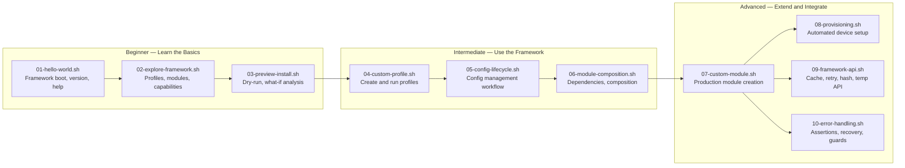

# Examples

> Practical, executable examples for Termux Bootstrap — from beginner to advanced.

---

## How to Run

Examples are standalone shell scripts that source the framework and demonstrate specific functionality. Run them from the project root:

```bash
# Beginner examples
bash examples/beginner/01-hello-world.sh
bash examples/beginner/02-explore-framework.sh
bash examples/beginner/03-preview-install.sh

# Intermediate examples
bash examples/intermediate/04-custom-profile.sh
bash examples/intermediate/05-config-lifecycle.sh
bash examples/intermediate/06-module-composition.sh

# Advanced examples
bash examples/advanced/07-custom-module.sh
bash examples/advanced/08-provisioning.sh [--profile <name>]
bash examples/advanced/09-framework-api.sh
bash examples/advanced/10-error-handling.sh
```

### Requirements

- Bash 5.0+
- Project root must be accessible (examples source the framework via relative path)

### Safety

- Examples use `--dry-run` where applicable
- Examples create temp files that are cleaned up on exit
- No system modifications are made without explicit commands being shown

---

## Progression Path



---

## Example Catalog

### Beginner

| # | File | Concepts | Est. Time |
|:-:|------|----------|:---------:|
| 01 | `01-hello-world.sh` | Framework boot, `framework_initialize()`, `show_version()`, `show_build_info()`, `dispatch_help()`, `log_*()` | 2 min |
| 02 | `02-explore-framework.sh` | `module_categories()`, `profile_exists()`, `has()`, `module_info()`, `run_doctor()`, framework constants | 3 min |
| 03 | `03-preview-install.sh` | `installer_set_dry_run()`, `installer_install_profile()`, `profile_modules()`, size estimation | 2 min |

### Intermediate

| # | File | Concepts | Est. Time |
|:-:|------|----------|:---------:|
| 04 | `04-custom-profile.sh` | Profile creation, `load_module()`, `installer_set_rollback()`, idempotency, framework integration | 5 min |
| 05 | `05-config-lifecycle.sh` | `config_list()`, `config_status()`, `config_validate()`, merge modes, state machine, sandboxed demo | 5 min |
| 06 | `06-module-composition.sh` | `module_deps()`, `resolve_module_deps()`, `profile_modules()`, dependency trees, deduplication | 5 min |

### Advanced

| # | File | Concepts | Est. Time |
|:-:|------|----------|:---------:|
| 07 | `07-custom-module.sh` | Module structure, `depends()` functions, `require_module()`, `pkg_install_many()`, `pip_install()`, verification patterns | 8 min |
| 08 | `08-provisioning.sh` | End-to-end provisioning, environment validation, post-install verification, reporting, rollback | 10 min |
| 09 | `09-framework-api.sh` | `cache_set/get()`, `retry()`, `create_secure_temp_*()`, `trim/to_lower/to_upper()`, `sha256/sha1/md5()`, `random_string()`, `timestamp/epoch/pause()` | 8 min |
| 10 | `10-error-handling.sh` | `assert_file/directory/command/variable()`, `die()` vs `panic()` vs `warn()`, recovery patterns, cleanup traps, guard variables | 10 min |

---

## Example Design

Each example follows a consistent structure:

```bash
#!/usr/bin/env bash
# ==============================================================================
# Example: <Title>
# Level:    <Beginner|Intermediate|Advanced>
# Usage:    bash <path>
# ==============================================================================
# <Description of what this example demonstrates>
#
# <Key concepts covered>
#
# <Expected behavior / output>
# ==============================================================================

set -euo pipefail

# --- Bootstrap ---
SCRIPT_DIR="$(cd "$(dirname "$(readlink -f "${BASH_SOURCE[0]}")")" && pwd)"
PROJECT_ROOT="$(cd "${SCRIPT_DIR}/../.." && pwd)"

# shellcheck source=../../lib/common.sh
source "${PROJECT_ROOT}/lib/common.sh"
framework_initialize

# --- Cleanup ---
WORK_DIR="$(mktemp -d)"
trap 'rm -rf "${WORK_DIR}"' EXIT

# --- Steps ---

# Step 1: ...
# Step 2: ...
# ...

log_success "Example complete"
```

---

## Writing Your Own Examples

To contribute an example:

1. Choose the appropriate level directory
2. Follow the example structure above
3. Include comments explaining each step
4. Use `assert_*` or `log_*` for output (not raw `echo`)
5. Clean up temp resources with a trap
6. Test that it works from the project root

### Naming Convention

```
<NN>-<short-description>.sh
```

Where `<NN>` is a two-digit sequence number (01, 02, 03...).
